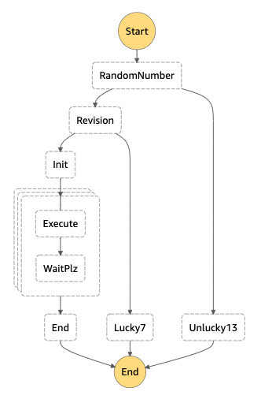

# The worst number logic (aka aws-sam-step-functions-lambda)
A simple example that shows the potential of **AWS Step Functions** using:

- TypeScript + Node for lambda implementation
- TypeScript + Jest for unit testing 
- API Gateway + OpenAPI/Swagger integration for API validation
- AWS SAM for infrastructure templating

## Requirements

- Node + NPM
- aws-cli (installed and configured)
- aws-sam-cli

## Deployment

There's a sh file called `deploy.sh` meant to be used for infrastructure creating/updating:

`sh deploy.sh <STACK_NAME> <S3_BUCKET>`

Where:

- `STACK_NAME` is the name of the stack
- `S3_BUCKET` refers to an existing S3 bucket where the OpenAPI definition is going to be upload

## The Workflow

It's a very simple and numeric logic that is represented by the workflow:



### RandomNumber

It generates a random number between 1 and 15.

If the number is 13 (unlucky thirteen) the step retry 2 times, and if there's the bad luck of getting the '13' three times in a row, the workflow unsuccessfully ends.

The result number is passed to the **Revision** task.

### Revision

If the number is 7 (lucky seven) the workflow successfully ends.

If the number is different from 7 or 13, the result number is passed to the task Init.

### Init

It builds an array with length n equals to 'number': [0, 1, ... n] and generates a Map task with that array.

### Execute

It generates a new number equals to the argument number or plus/minus 1.

It prints on the console the 2 values.

### WaitPlz

It stops the process for 2 seconds.

### End

It calculates the sum of all the Map executions.

## API endpoints

### Execution start

The exposed endpoint is `POST` to `random-workflow/` path. The body of the request is passed as an input to the workflow execution.

The response includes the execution identificator for the status request:

```
{
  "executionId": "<EXECUTION_ID>"
}
```

### Execution status

The exposed endpoint is `GET` to `random-workflow/<EXECUTION_ID>` path.

The response content is:

```
{
  "status": "<EXECUTION_STATUS>",
  "output": <EXECUTION_OUTPUT>
}
```

Where `EXECUTION_OUTPUT` is present when status is `SUCCEED` and it's an object with the result of the execution.
